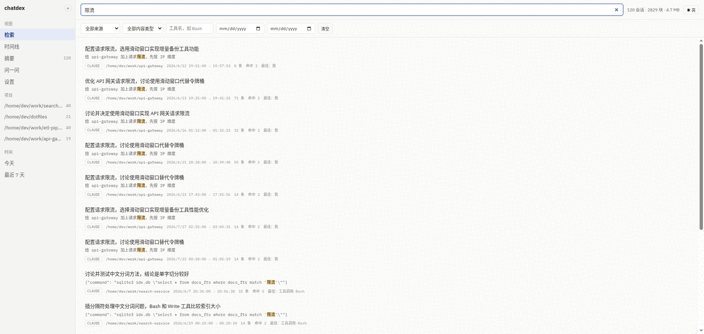
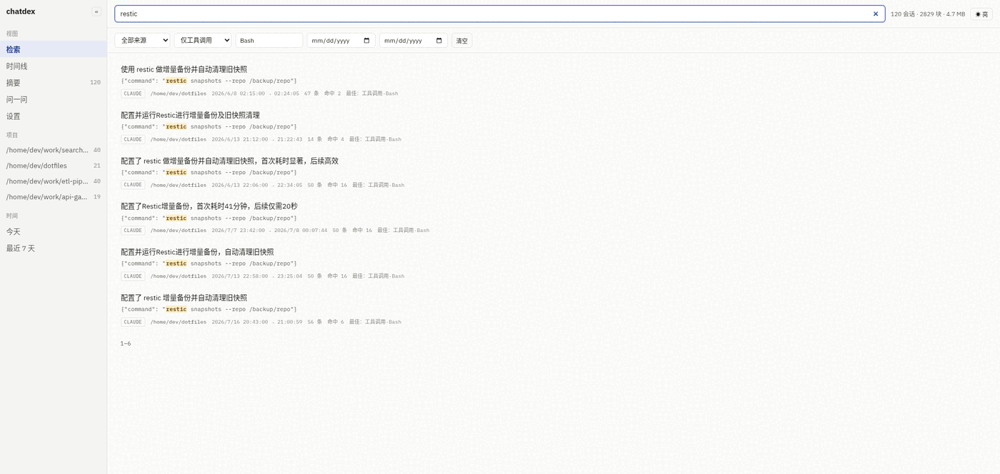
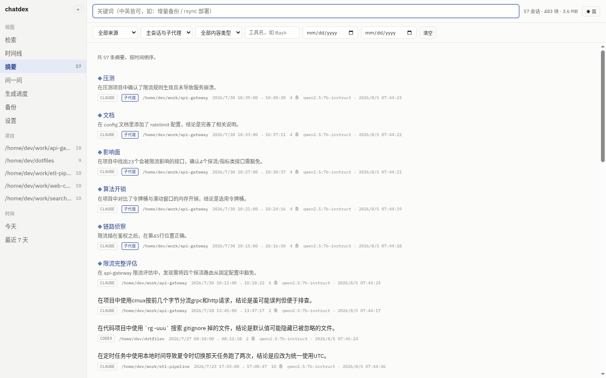
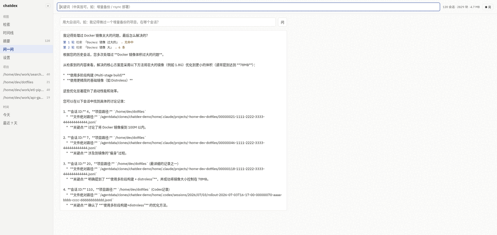
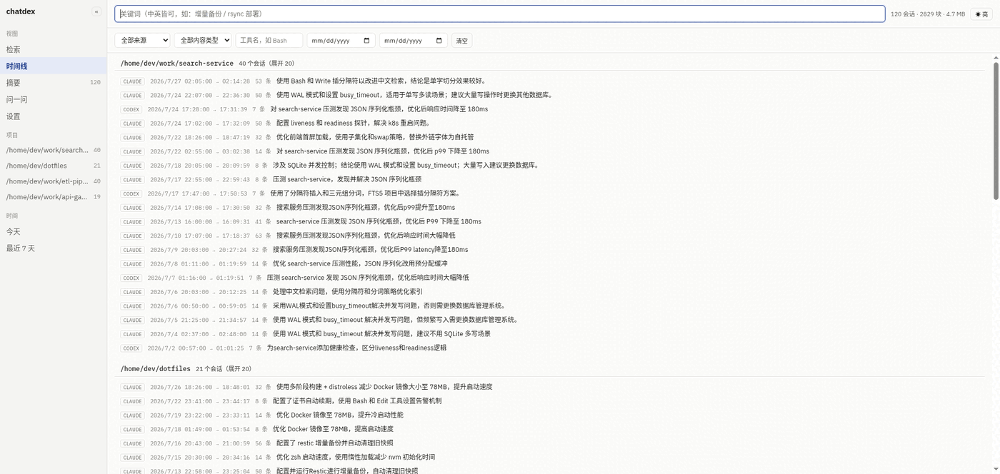
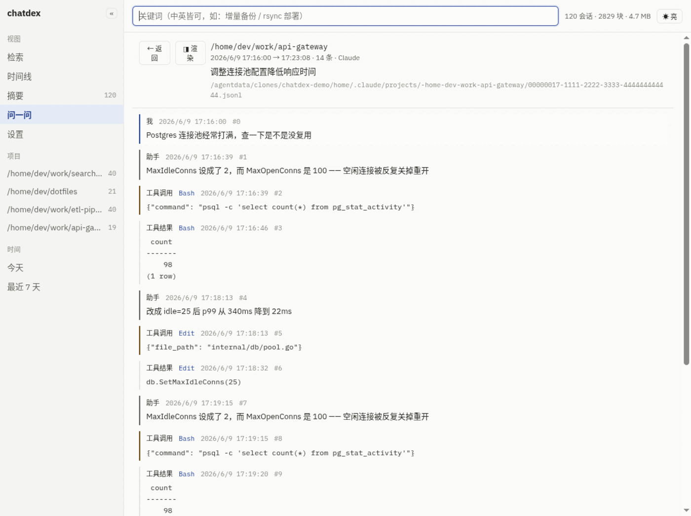
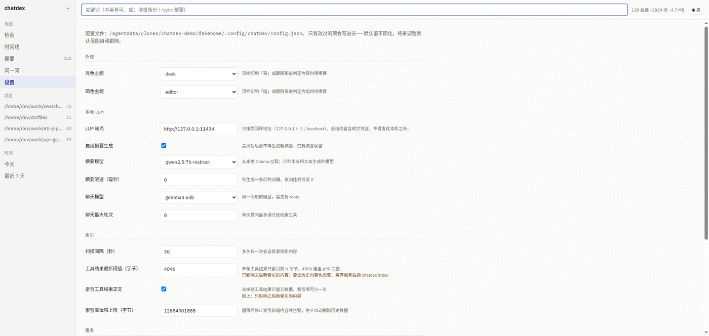
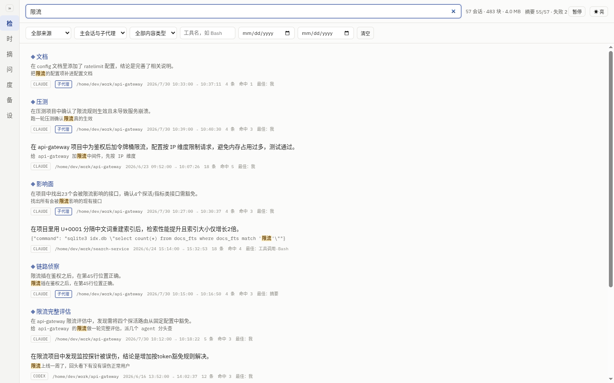

# chatdex

**Make every past Claude Code and Codex session searchable.** Runs locally, reads only, never phones home.

[简体中文](README.md) | English

[](https://go.dev)
[](LICENSE)
[](https://sqlite.org/fts5.html)
[](https://modelcontextprotocol.io)

> [!NOTE]
> **The dashboard UI is currently Chinese-only.** The code, docs, and this README are in English, but
> the interface is not localized yet — navigation reads 检索 / 时间线 / 摘要 / 问一问 / 设置
> (Search / Timeline / Summaries / Ask / Settings). Search itself is language-agnostic and works fine
> on English transcripts. If you'd use an English UI, say so in an issue and it moves up the list.

> Every decision you made with an AI assistant, every trap you fell into, every command you finally
> got right — it's all sitting in thousands of JSONL files with no way back in. chatdex gives you
> that way in. And gives it to your agents too.



---

## Why

`~/.claude/projects/` and `~/.codex/sessions/` hold your entire working history. `grep` doesn't cut it:

- **CJK doesn't match.** SQLite FTS5's `unicode61` treats a whole Chinese sentence as one token, so
  searching 「限流」 never finds 「请求限流」.
- **Most hits ≠ what you want.** Measured on a real corpus: the two sessions with the most hits
  (2272 and 2154) were both wrong; the one I wanted had 669. Those two just mentioned the word
  repeatedly in build logs.
- **The answer is usually in a tool call.** "How did I write that command last time" isn't in the
  prose — it's in the `tool_use` arguments.
- **Your words aren't the transcript's words.** You remember "incremental backup"; the transcript
  says "something like TimeMachine".

chatdex has a specific answer to each, with measured numbers behind it — see
[`docs/architecture.md`](docs/architecture.md).

## Features

| | |
|---|---|
| 🔍 **Mixed CJK/ASCII full-text search** | Per-character CJK splitting over FTS5. Median latency **23 ms** on a real 3 176-session / 632 K-block corpus |
| 🧠 **Summaries are indexed too** | A local LLM writes one line per session, **rephrasing in conceptual terms** — which is what closes the vocabulary gap above |
| 💬 **Ask** | Ask in plain language; the LLM rewrites its query and retries across rounds, and **shows you every query it tried** |
| 🕘 **Timeline & transcript replay** | Grouped by project; click through to read the original exchange, paginated for long sessions |
| 🔌 **MCP endpoint** | Your agent can look up "how did I solve this last time" by itself |
| 🎨 **Four themes** | Light/dark/follow-system, all contrast ratios verified against WCAG AA by script |
| ⚙️ **Settings UI** | Change config in the browser; most options take effect immediately |
| 🔒 **Read-only, localhost-only** | See [Security boundaries](#security-boundaries) |

## Quick start

Requires Go 1.26+. **No** Node, no build chain, no Docker, no network access.

```bash
git clone https://github.com/cygmris/chatdex.git && cd chatdex
go build -o ~/.local/bin/chatdex ./cmd/chatdex

chatdex index      # first full index — ~13 min for 3 000 sessions
chatdex serve      # dashboard :5021 / API+MCP :5022
```

Open <http://127.0.0.1:5021>. To keep it running:

```bash
cp deploy/systemd/chatdex.service ~/.config/systemd/user/
systemctl --user enable --now chatdex
```

Full deployment and troubleshooting: [`docs/deploy.md`](docs/deploy.md).

### Optional: local LLM

Summaries and Ask need a local [Ollama](https://ollama.com). **It is an optional dependency** —
without it indexing and search work exactly the same; you just lose the Ask tab and the summary line.

```bash
ollama pull qwen2.5:7b-instruct
```

The endpoint **only accepts loopback addresses**. A remote address is rejected outright and there is
no flag to relax it — see below for why.

### Wire up MCP

Let an agent search its own history:

```json
{
  "mcpServers": {
    "chatdex": { "url": "http://127.0.0.1:5022/mcp" }
  }
}
```

Three tools: `search_sessions`, `get_session`, `list_projects`.

## Screenshots

> All screenshots use **synthetic demo data** — 120 fabricated sessions across 4 fictional projects.
> Not anyone's real transcripts.

### Search: summary as the headline, snippet as evidence

Every result leads with the session summary, so you can tell at a glance which one you want.
The snippet below it shows *why* it matched.


### Filter down to the tool call

Six filters: source, content kind, tool name, project, and date range. Filtering to tool calls is how
you answer "how did I write that command last time" — the match lands right on the command itself.



### Summaries

Browse or search all session summaries. Each shows which model generated it and when, because a
summary's trustworthiness depends on that.



### Ask

Ask in plain language. The LLM rewrites the query and retries — **and every round is shown**, so you
can tell whether it searched in a sensible direction. Session IDs in the answer are clickable.



### Timeline

Grouped by project, newest first — useful for "what was I even doing that week".



### Transcript replay

Read the original exchange message by message, tool calls and results included, with the absolute
path of the source file so you can always get back to the ground truth.



### Settings

Every config option, rendered from a single declaration in the backend. Options needing a restart say
so; index options note that they only affect newly indexed content.



### Collapsible sidebar

Collapses to 46 px with single-character navigation, for when you want the width back.



## Security boundaries

Your transcripts contain configs you `cat`-ed, variables you `env`-ed, tokens you passed to `curl`.
**The index is a concentrated copy of all that.** So these four are hard constraints with no opt-out,
each covered by tests:

| Constraint | How it's enforced |
|---|---|
| **Never writes session files** | Always `os.Open` (`O_RDONLY`). An E2E test byte-compares size / mtime / content of the originals after a full run |
| **Binds `127.0.0.1` only** | The address is not a config option. An integration test actually dials the LAN IP and fails if it connects |
| **Index DB is `0600`** | Main DB plus `-wal` / `-shm` all explicitly chmod-ed; directory `0700` |
| **LLM endpoint must be loopback** | Construction fails outright — no `--allow-remote` escape hatch. Seven negative tests covering remote, LAN, and wildcard addresses |

The config file is `0600` too, written via `.tmp → chmod → rename` so a power cut can't leave half a
JSON behind.

## This is **not** a backup

The index stores *derived* text, not a copy of the original. Measured: 5.9 GB of source transcripts
became 549 MB of indexed text (~9%). The gap is JSONL structural overhead plus these deliberate losses:

- Tool results are **truncated at 4096 bytes** (configurable) — 38 K of 650 K blocks were truncated
- Images, binaries, and reasoning traces are **not indexed**
- The `CLAUDE.md` / `AGENTS.md` text injected into every session's first message is **stripped**

The original `.jsonl` files remain the only source of truth; every record stores their absolute path
and offset so it can point back. **For backups, use a backup tool.**

## Measured

Real corpus on real hardware, not a synthetic benchmark:

| | |
|---|---|
| Sessions / blocks | 3 176 / 632 322 |
| Index size | 1.0 GB (full index in 13 min 0 s) |
| Search latency | median **23 ms**; 19 of 20 real queries under 260 ms |
| Slowest query | 342 ms — a single common CJK character matching ~100 K blocks |
| Summary throughput | median 0.8 s/session; all 3 176 done in **2 h 13 min** |

## The two JSONL formats differ (read before writing a parser)

| | Claude Code | Codex |
|---|---|---|
| Path | `~/.claude/projects/<slug>/<uuid>.jsonl` | `~/.codex/sessions/YYYY/MM/DD/rollout-*.jsonl` |
| Role lives at | `message.role` | `payload.role` (outer `type: response_item`) |
| Text field | `content` as string, or list items with `type=="text"` | list items with `type=="input_text"` |
| Subagents | separate `<uuid>/subagents/agent-*.jsonl` | same file |

Parsers are pluggable — implement the `Parser` interface in `internal/parser` and neither the index
nor the search layer needs to change.

## Why there's no vector search

The vocabulary gap is real: you remember "incremental backup", the transcript says "something like
TimeMachine", and keyword search returns nothing. But vectors aren't the only fix, or necessarily the
best one:

- **Summaries are text, and they rephrase in conceptual terms.** With the summary "discussed building
  an incremental backup tool on restic", searching "incremental backup" **hits via plain keywords**.
- **The agent rewrites its query and retries.** Vectors can't: they give one similarity ranking and
  never rephrase because the results looked wrong.
- In-process embeddings — model choice, binary size, full-corpus vectorization time, hybrid ranking
  tuning — are the single most expensive piece of this project.

So it's **gated**: collect 10 real cases where summaries *and* agent rewriting both failed. If this
design solves ≥8 of 10, the requirement is closed permanently; otherwise it reopens and that set
becomes its acceptance criteria. There is no embedding table or column pre-wired in the code.

## Docs

- [`docs/architecture.md`](docs/architecture.md) — architecture and nine key decisions **with their
  costs**, including the full post-mortem of a 63.8 s → 276 ms query fix
- [`docs/deploy.md`](docs/deploy.md) — deployment, configuration, troubleshooting
- [`docs/design-parity.md`](docs/design-parity.md) — where the UI departs from its design mock, and why

## License

MIT — see [`LICENSE`](LICENSE).

Bundled fonts are [IBM Plex](https://github.com/IBM/plex) (Sans / Mono) under the SIL Open Font
License 1.1; full text at `internal/dashboard/static/fonts/LICENSE.txt`. Bundling them is deliberate:
the page references no external domain, so it works offline and leaks nothing about your browsing to
a third party.
