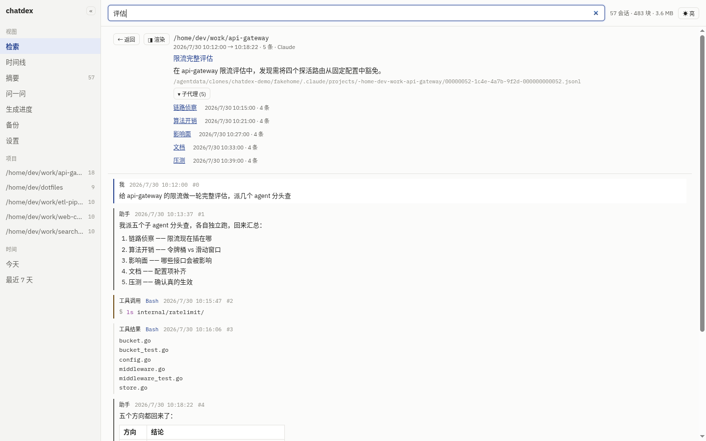
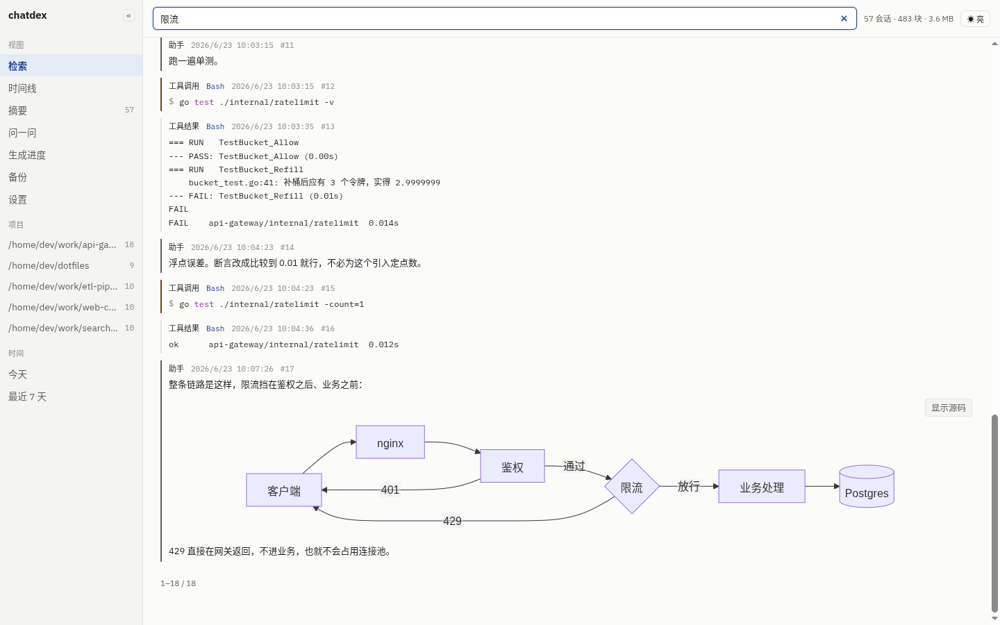
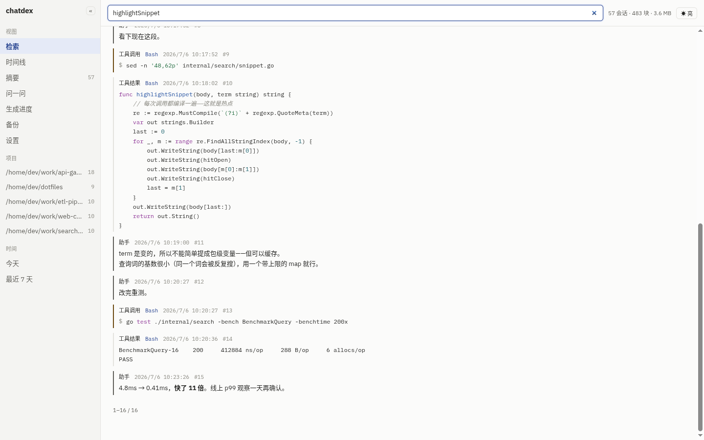
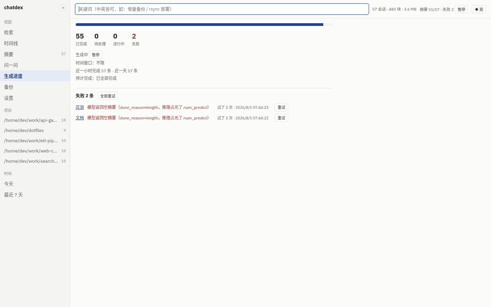
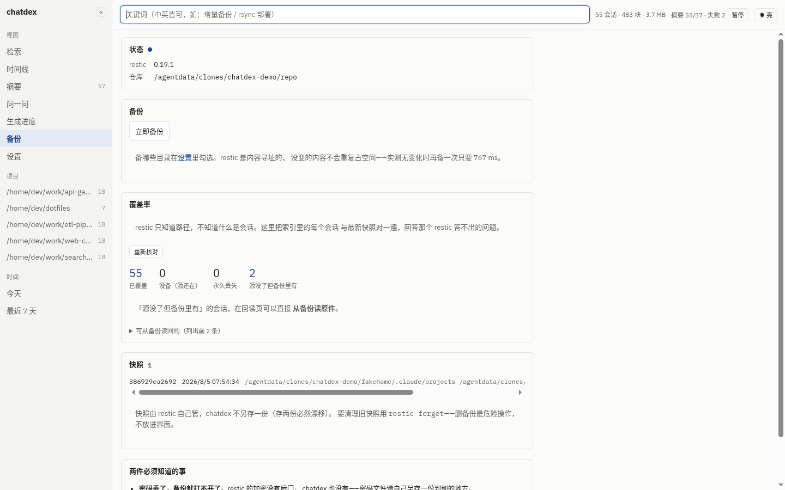
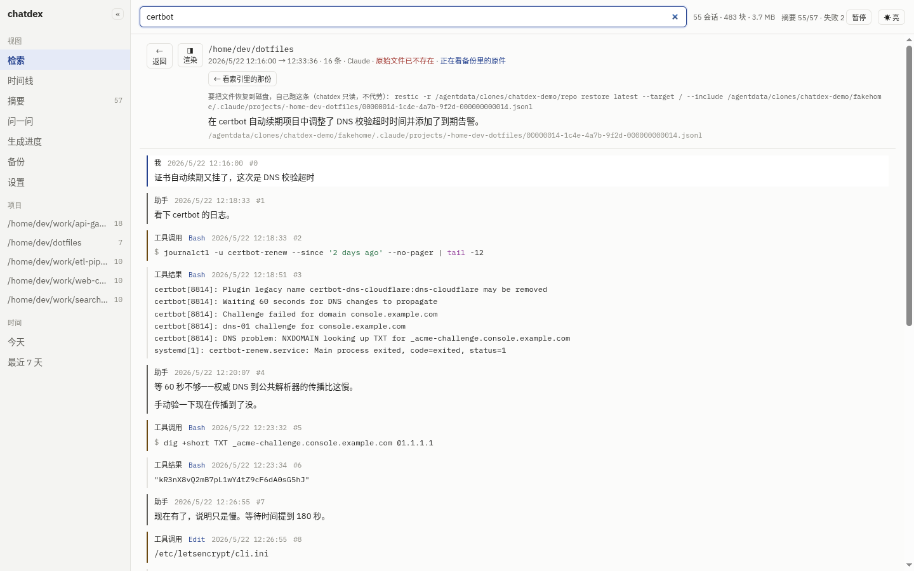

# chatdex

**把 Claude Code 与 Codex 的全部历史会话变成可检索的东西。** 本地常驻，只读，不联网。

简体中文 | [English](README.en.md)

[](https://github.com/cygmris/chatdex/actions/workflows/ci.yml)
[](https://github.com/cygmris/chatdex/releases/latest)
[](https://go.dev)
[](LICENSE)
[](https://sqlite.org/fts5.html)
[](https://modelcontextprotocol.io)

> 你和 AI 一起做的每个决定、踩过的每个坑、写对的每条命令，都躺在几千个 JSONL 文件里，
> 没有任何入口能找回来。chatdex 给它们一个入口——给你，也给 agent 自己。


---

## 它解决什么

`~/.claude/projects/` 和 `~/.codex/sessions/` 里堆着你全部的工作记录。`grep` 撑不住，因为：

- **中文搜不到。** SQLite FTS5 的 `unicode61` 把一整句中文当成一个 token，搜「限流」搜不出「请求限流」。
- **命中最多 ≠ 你要找的。** 真实语料实测：命中最多的两个会话（2272 / 2154 次）都不是目标，
  目标只命中 669 次——那两个只是在长日志里反复提到这个词。
- **答案往往在工具调用里。** 「上次那条命令怎么写的」不在对话正文，在 `tool_use` 的参数里。
- **你记的词和原文的词对不上。** 记忆里是「增量备份」，原文写的是「类似 TimeMachine 的管理工具」。

chatdex 对这四条各有对策，且都有实测数字撑着——见 [`docs/architecture.md`](docs/architecture.md)。

## 特性

| | |
|---|---|
| 🔍 **中英混合全文检索** | CJK 单字切分 + FTS5，中位延迟 **37 ms**（3265 会话 / 74.7 万块的真实语料） |
| 🧠 **摘要一并入索引** | 本地 LLM 给每个会话写一句话摘要，**用概念词重写原文**——这正是填平上面那条词汇鸿沟的手段 |
| 💬 **问一问** | 用大白话提问，LLM 多轮改写查询自己重试，并**把每一轮搜了什么都摊开给你看**；可限定在某个项目内问，也可全库问 |
| 🏷 **会话名** | 你 `/rename` 起的名字优先于 LLM 摘要显示——人写的比机器猜的可信 |
| 🕘 **时间线与会话回读** | 按项目聚合；点进去逐条回读原始对话，长会话分页 |
| 🧬 **子代理串起来** | 近一半会话是子代理（本机 48.5%）。可以只看主会话、只看子代理；主会话能展开它派出去的子代理，子代理能一键跳回主会话 |
| 📝 **Markdown / ANSI / 语法高亮** | assistant 输出按 Markdown 显示，命令输出的颜色码正确上色，代码与命令有语法高亮（配色可选，默认跟随界面主题）；mermaid 图点一下才渲染；回读页可一键切回**原文**看原始字节 |
| 🔗 **可分享的链接** | 视图、检索词、全部过滤条件、正在读的会话都在 URL 里——发给别人能还原同样的结果，后退键也照常用 |
| 🔌 **MCP 端点** | agent 可以自己查「我上次是怎么解决这个的」 |
| 🎨 **四套主题** | 亮 / 暗 / 跟随系统，四套配色的对比度全部由脚本验证达到 WCAG AA |
| ⚙️ **设置页** | 配置项在浏览器里改，多数即时生效 |
| 📈 **生成进度** | 摘要跑到哪、还要多久、哪几条失败了为什么、一键重试；可设**只在某个时间段生成**（如夜里 `02:00-08:00`，支持跨零点） |
| 🗄 **备份（对接 restic）** | restic 管存得住存得安全，chatdex 管它做不到的：**你索引过的会话，备份里到底有没有**；源文件消失后还能直接读回原件。restic 是可选依赖 |
| 🔒 **只读 + 只本机** | 见下方[安全边界](#安全边界) |

## 快速开始

单个静态二进制，**不需要** Node、构建链、Docker，或任何网络访问。

从 [Releases](https://github.com/cygmris/chatdex/releases/latest) 下对应平台的包
（linux / macOS × amd64 / arm64）：

```bash
tar -xzf chatdex_0.1.0_linux_amd64.tar.gz
install -m755 chatdex_0.1.0_linux_amd64/chatdex ~/.local/bin/chatdex

chatdex index      # 首次全量索引，3000 会话约 13 分钟
chatdex serve      # dashboard :5021 / API+MCP :5022
```

或者自己构建（需 Go 1.26+）：

```bash
git clone https://github.com/cygmris/chatdex.git && cd chatdex
go build -o ~/.local/bin/chatdex ./cmd/chatdex
```

浏览器打开 <http://127.0.0.1:5021>。常驻运行：

```bash
cp deploy/systemd/chatdex.service ~/.config/systemd/user/
systemctl --user enable --now chatdex
```

完整部署与排查见 [`docs/deploy.md`](docs/deploy.md)。

### 可选：本地 LLM

摘要与「问一问」需要本地 [Ollama](https://ollama.com)。**它是可选依赖**——不装照样索引、照样检索，
只是少了问一问这个页面和条目上的摘要行。

```bash
ollama pull qwen2.5:7b-instruct
```

端点**只接受回环地址**，填远端会被直接拒绝，且没有任何开关可以放宽——原因见下。

### 接入 MCP

让 agent 自己查历史：

```json
{
  "mcpServers": {
    "chatdex": { "url": "http://127.0.0.1:5022/mcp" }
  }
}
```

提供三个工具：`search_sessions`、`get_session`、`list_projects`。

> ⚠️ **走 HTTP（Streamable HTTP），不是 stdio。** chatdex 是一个常驻服务，
> MCP 端点挂在已经在跑的那个进程上（`:5022/mcp`）——所以配置里填 `url`，
> **不要**写成 `{"command": "chatdex", "args": ["serve"]}` 那种 stdio 形式：
> 那样客户端会一直等 stdio 上的 JSON-RPC，而进程在监听 HTTP，双方谁也等不到谁。
> 先 `chatdex serve`（或用 systemd 常驻），再让客户端连上面那个 URL。

## 界面

> 所有截图用的都是**造出来的演示数据**——57 个虚构会话、5 个虚构项目，不是任何人的真实会话。
> 生成器就在仓库里：[`scripts/gen-demo-corpus.py`](scripts/gen-demo-corpus.py)，这句话可以自己验证。

### 检索：摘要是主标题，片段是证据

每条结果以会话摘要打头，一眼能看出是不是你要的那个；下面的片段说明它**为什么**匹配。


### 筛到工具调用那一层

七项过滤：来源、**主会话 / 子代理**、内容类型、工具名、项目、起止日期。筛到工具调用，正是回答
「上次那条命令怎么写的」的用法——命中直接落在命令本身上。


### 子代理串起来

近一半的会话是子代理（本机 3265 个会话里有 1591 个），它们过去混在结果里既看不出身份也筛不掉。
现在可以只看主会话或只看子代理；主会话能展开它派出去的子代理，子代理能一键跳回主会话。



### 摘要

翻或搜全部会话摘要。每条都标出由哪个模型、什么时候生成——摘要可信到什么程度，取决于这两件事。


### 问一问

用大白话提问，LLM 改写查询自己重试，**且每一轮都摊开显示**，你才知道它有没有搜对方向。
答案里的会话号可以直接点进去。


### 时间线

按项目聚合、按时间倒序——适合回答「那阵子我到底在干什么」。


### 会话回读

逐条回读原始对话。assistant 的输出按 Markdown 渲染、命令输出的 ANSI 颜色正确上色，
代码块与命令有**语法高亮**（highlight.js 随包分发，配色在设置页选，默认那套跟随界面主题）。
`cat` / `sed -n` 这类读文件命令的**输出**同样按源码高亮——语言从命令里的文件名判定，
判不出就保持原样，**绝不对输出做自动识别**（那只会把构建日志涂成花的）。
mermaid 图默认显示源码、点「渲染图表」才加载渲染器。
**工具调用按结构显示**——命令就是命令（复制下来能直接跑）、文件编辑是前后对照、patch 是带色的 diff。左上角一键切「原文」看索引时存下的原始字节——这是取证工具，
看到原始字节有时才是重点。地址栏里带着会话号，刷新与分享都能回到同一处。


代码块与命令有语法高亮，mermaid 图点一下才渲染（渲染器 3.4 MB，不点就不加载）：



读文件命令的**输出**同样按源码高亮，而紧挨着的 `go test` 输出保持素色——
语言只从命令里判，判不出就不涂：



### 生成进度

摘要在后台持续生成。这一页说清楚它跑到哪了、还要多久、**哪几条失败了、为什么**，
失败可以逐条或整体重试。也能设「只在某个时间段生成」——夜里挂机跑，白天不抢 GPU。



### 备份

restic 只知道路径，不知道什么是会话。这一页回答那个 restic 答不出的问题——
把索引里的每个会话和最新快照对一遍，分成四个数：**已覆盖 / 没备（源还在）/
永久丢失 / 源没了但备份里有**。中间两个都是「没备」，但一个是去设置里勾上就好，
另一个是永久丢失，混成一个数就是说谎。



「源没了但备份里有」的会话，在回读页可以直接**从备份读原件**——而且比索引里
那份更完整：索引对工具结果是故意截断的（默认 4096 字节），完整内容只在原件里。
界面上给出可复制的 `restic restore` 命令，但**不代你执行**。



chatdex **不做 restic 的壳子**：不做定时调度、不做保留策略、不代做 restore
（界面只给出可复制的命令）。restic 没装也不影响索引与检索，备份入口置灰并说明原因。

### 设置

全部配置项由后端的**单一份**元信息渲染而来。需重启的项会明说；索引相关项会注明只影响之后新索引的内容。


### 左栏可收起

收起成 46px 单字导航，需要把宽度还给正文时用。


## 安全边界

会话记录里有你 `cat` 过的配置、`env` 打过的变量、`curl` 带过的 token。**索引库是这些东西的集中副本。**
所以下面四条是硬约束，代码里没有开关，每条都有测试守着：

| 约束 | 怎么保证的 |
|---|---|
| **绝不写会话文件** | 一律 `os.Open`（`O_RDONLY`）。E2E 测试跑完整流程后，逐字节比对原始文件的 size / mtime / 内容 |
| **只监听 `127.0.0.1`** | 地址不做成配置项。集成测试真的去局域网 IP 上连一次，连得上就算失败 |
| **索引库 `0600`** | 主库与 `-wal` / `-shm` 都显式 chmod，目录 `0700` |
| **LLM 端点只允许回环** | 构造即失败，没有 `--allow-remote` 之类的逃生口。7 个远端 / 内网 / 通配地址的负例测试 |

配置文件同样是 `0600`，写入走 `.tmp → chmod → rename`，断电不会留下半个 JSON。

## 索引库**不是**备份（备份是 restic 的活）

索引库存的是**派生文本**，不是原文副本。实测：原始会话 5.9 GB，入库正文 549 MB（约 9%）。
差额来自 JSONL 结构开销，以及这些刻意的取舍：

- 工具结果**按 4096 字节截断**（可配）——实测 65 万块里有 3.8 万块被截
- 图片、二进制、思考过程等**不入库**
- 每个会话首条消息里注入的 `CLAUDE.md` / `AGENTS.md` 全文**被剥离**

原始 `.jsonl` 才是唯一事实来源，每条记录都存了它的绝对路径与偏移量以便随时指回去。

**备份交给 restic，chatdex 只做它做不到的那部分。** 分工是：restic 管「存得住、存得安全」
（内容寻址去重、压缩、加密、`restic check`）；chatdex 管 restic 不可能知道的事——
哪些路径该备、**索引过的会话备份里到底有没有**、以及源文件消失之后怎么把原件读回来。
restic 只看得见路径，它不知道什么是会话。

chatdex **不做 restic 的壳子**：不做定时调度（那是 systemd timer 的活）、不做保留策略、
不代做 restore（只读铁律对恢复同样成立，界面只给出可复制的命令）。restic 是**可选依赖**，
没装照样索引照样检索，备份入口置灰并说明原因。

## 实测数据

真实语料、真实机器，不是合成基准：

全部为 2026-08-05 同一次测量（历史对照见 [architecture.md](docs/architecture.md)）：

| | |
|---|---|
| 会话 / 内容块 | 3 265（存活 3 082 · 源已消失 183）/ 747 153 |
| 入库正文 / 索引库 | 0.59 GB / 3.1 GB |
| 检索延迟 | 中位 **37 ms** · p95 113 ms |
| 最慢查询 | 529 ms——单个 CJK 常用字「的」，命中 12.1 万块的退化情形 |
| 摘要吞吐 | 中位 0.8 s/会话，全量 **2 小时 13 分**跑完（2026-07-29 那次的记录，未重跑） |

## 两套 JSONL 格式不同（写解析器前必读）

| | Claude Code | Codex |
|---|---|---|
| 路径 | `~/.claude/projects/<slug>/<uuid>.jsonl` | `~/.codex/sessions/YYYY/MM/DD/rollout-*.jsonl` |
| 角色字段 | `message.role` | `payload.role`（外层 `type: response_item`） |
| 文本字段 | `content` 为 str，或 list 中 `type=="text"` | list 中 `type=="input_text"` |
| 子代理 | 另存 `<uuid>/subagents/agent-*.jsonl` | 同文件内 |

解析器可插拔——在 `internal/parser` 里实现 `Parser` 接口即可，索引与检索都不用碰。

## 为什么没有向量语义检索

词汇鸿沟是真的：记忆里是「增量备份」，原文写的是「类似 TimeMachine 的管理工具」，关键词**零命中**。
但向量不是唯一解，也未必最优：

- **摘要是文本，且用概念词重写原文。** 若存有摘要「讨论基于 restic 做增量备份工具」，
  搜「增量备份」**关键词就命中了**。
- **agent 会多轮改写查询重试**，向量做不到：它只给一次相似度排名，不会因为结果不对就换个说法再搜。
- 进程内 embedding 的选型、模型体积、全量向量化耗时、混合排序调参，是全项目最贵的一块。

所以这件事被设成**门控**：先攒 10 个真实的「摘要 + agent 改写都没搜到」的案例做基准集。
这套设计若能解决 ≥8/10，该需求永久关闭；否则才重开，并以那个基准集验收。
代码里没有预埋任何 embedding 表或字段。

## 文档

- [`docs/architecture.md`](docs/architecture.md) —— 架构与九个关键决策**及它们的代价**，
  含 63.8 s → 276 ms 那次查询性能事故的完整归因
- [`docs/deploy.md`](docs/deploy.md) —— 部署、配置、排查
- [`docs/design-parity.md`](docs/design-parity.md) —— 界面与设计稿的逐条差异及原因

## 许可

代码 MIT，见 [`LICENSE`](LICENSE)。

内置字体为 [IBM Plex](https://github.com/IBM/plex)（Sans / Mono），SIL Open Font License 1.1，
许可全文在 `internal/dashboard/static/fonts/LICENSE.txt`。字体随二进制打包是刻意的——
页面不引用任何外部域名，既保证离线可用，也不向第三方泄露你的浏览行为。

渲染用到四个随二进制打包的库（同样不引用任何外部域名）：
[marked](https://github.com/markedjs/marked)（MIT）、
[DOMPurify](https://github.com/cure53/DOMPurify)（Apache-2.0 / MPL-2.0）、
[highlight.js](https://github.com/highlightjs/highlight.js)（BSD-3-Clause）与
[mermaid](https://github.com/mermaid-js/mermaid)（MIT），
许可全文在 `internal/dashboard/static/vendor/`。
mermaid 有 3.4 MB，**不在首屏加载**——只有你点「渲染图表」时才会取。
